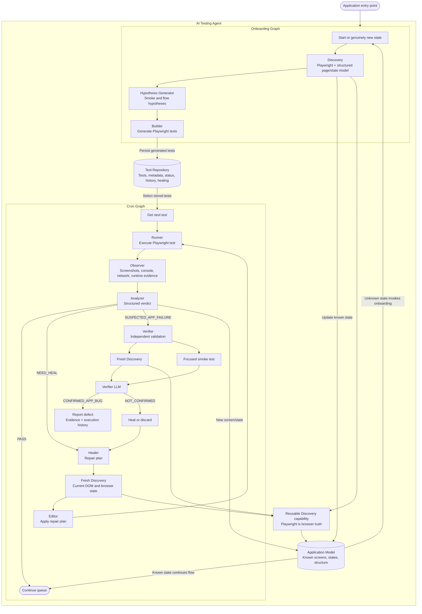

# AI Testing Agent Self-Healing Web Testing Architecture

AI Testing Agent separates one-time application understanding from continuous test execution. Playwright supplies deterministic browser evidence; LLM-based components reason over that structured evidence for hypothesis generation, diagnosis, healing, and verification.

## Architecture Responsibilities

- **Onboarding Graph**: Discovers an application state, generates smoke and flow hypotheses, and builds initial executable tests.
- **Cron Graph**: Selects stored tests, runs them continuously, captures evidence, and routes outcomes.
- **Discovery**: A reusable Playwright capability used by onboarding, healing, and verification. It returns structured page and state data rather than relying on an LLM to inspect the DOM.
- **Hypothesis Generator**: Converts the Application Model into candidate smoke and flow tests.
- **Builder**: Converts accepted hypotheses into Playwright test scripts.
- **Runner and Observer**: Execute tests and capture browser evidence without LLM-driven interaction.
- **Analyzer**: Emits one machine-readable verdict: `PASS`, `NEED_HEAL`, or `SUSPECTED_APP_FAILURE`.
- **Healer and Editor**: Use fresh discovery around a failed interaction, create a repair plan, update the test, and rerun it.
- **Verifier**: Independently performs fresh discovery and a focused smoke test before confirming an application bug.
- **Application Model**: Stores known screens, states, and discovered structure.
- **Test Repository**: Stores generated tests, metadata, status, execution history, and healing information.

## Execution Lifecycle

1. Onboarding discovers the initial application state.
2. Hypotheses are generated and converted into Playwright tests.
3. Tests are stored in the Test Repository.
4. Cron selects tests for continuous execution.
5. Runner executes and Observer captures evidence.
6. Analyzer returns `PASS`, `NEED_HEAL`, or `SUSPECTED_APP_FAILURE`.
7. Healing uses fresh discovery to repair and rerun invalid tests.
8. Verification uses fresh discovery plus a focused smoke test before reporting a bug.
9. Newly encountered states are compared with the Application Model; genuinely new states invoke onboarding.

## Current Repository Status

The repository currently contains a React/Vite client and a Python backend scaffold. The AI Testing Agent graphs, Playwright runtime, persistence layers, and API integration described above are proposal architecture and remain to be implemented.
